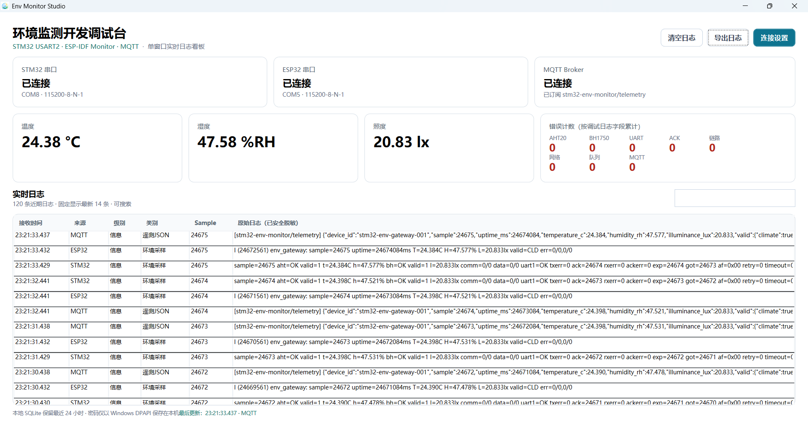

# 环境监测开发调试台（Env Monitor Studio）

环境监测开发调试台是一款面向 STM32 环境监测项目的 Windows 上位机。它可以同时查看 STM32 串口、ESP32 串口和 MQTT 遥测日志，把温度、湿度、照度、连接状态和错误次数集中显示在一个窗口中，便于设备联调和故障排查。

它是原生 Windows 桌面程序，不会打开浏览器，也不依赖网页界面。



## 可以做什么

- 同时连接 STM32 USART2 串口、ESP32 ESP-IDF Monitor 串口和 MQTT Broker。
- 实时显示温度、湿度、照度与三路连接状态。
- 汇总 AHT20、BH1750、UART、ACK、链路、网络、队列和 MQTT 错误次数。
- 显示最新调试日志，并可按关键词即时搜索。
- 一键清空本地日志，或导出最近 24 小时的日志 CSV 文件。
- 在无硬件日志时保持空白状态，不生成模拟数据。

## 快速开始

### 直接运行

在发布目录中双击 `EnvMonitor.Studio.exe`：

```text
release\开发调试端-日期-时间\EnvMonitor.Studio.exe
```

若从源码运行，请在项目根目录执行：

```powershell
dotnet run --project src\EnvMonitor.Studio\EnvMonitor.Studio.csproj
```

也可以使用：

```powershell
npm.cmd run dev
```

上述命令启动的都是原生 WPF 桌面程序。

## 首次连接

点击窗口右上角的“连接设置”。

### STM32 与 ESP32 串口

1. 点击“刷新串口”。
2. 为 STM32 和 ESP32 分别选择对应的 COM 口。
3. 常用串口参数为 `115200-8-N-1`。
4. 分别点击“连接”。连接成功后，主窗口会显示对应串口状态。

### MQTT

填写 Broker 主机、端口、Client ID、遥测 Topic、状态 Topic、用户名和密码，再点击“保存并连接 MQTT”。

对于常见的公有 CA MQTTS 服务：

- 通常使用端口 `8883`。
- 保持“校验 Broker 证书”勾选。
- CA 文件、客户端证书和私钥路径可留空。

对于私有 CA，请填写 CA 文件路径；对于双向 TLS，还需填写客户端证书与私钥路径。证书内容不会保存到项目或导出文件中。

## 日志与导出

主窗口固定显示最新 14 条日志，方便在不滚动页面的情况下观察最新状态。右侧搜索框可按来源、日志正文或类别筛选当前看板。

点击“导出日志”会导出本机 SQLite 中最近 24 小时的全部脱敏日志为 CSV。文件使用 UTF-8 BOM 编码，可直接由 Excel 正确打开。

点击“清空日志”会删除本机已保存的日志，该操作无法恢复。

## 数据与隐私

- 日志与连接设置只保存在当前 Windows 用户的 `%LOCALAPPDATA%\EnvMonitorStudio` 目录。
- MQTT 密码使用 Windows DPAPI 加密保存，仅当前 Windows 用户可以读取。
- 串口与 MQTT 日志在显示、保存和导出前会对常见密码、Token 和 API Key 字段进行脱敏。
- 数据库、发布文件、本地配置、证书和私钥均不会提交到 Git 仓库。
- 项目不包含真实 Broker 地址、账号、密码、Wi-Fi 密码、API Key、私钥或证书正文。

## 支持的日志信息

Studio 可识别 STM32 文本日志中的 `sample`、温湿度照度、AHT20/BH1750 错误、UART 错误、ACK、重试、超时、丢帧、队列丢弃与 RTOS 资源字段；也可识别 ESP32 的环境采样、网络、队列和发布统计日志，以及 MQTT 遥测 JSON。

未知或格式不完整的日志仍会保留为原始脱敏文本，不会中断采集。
